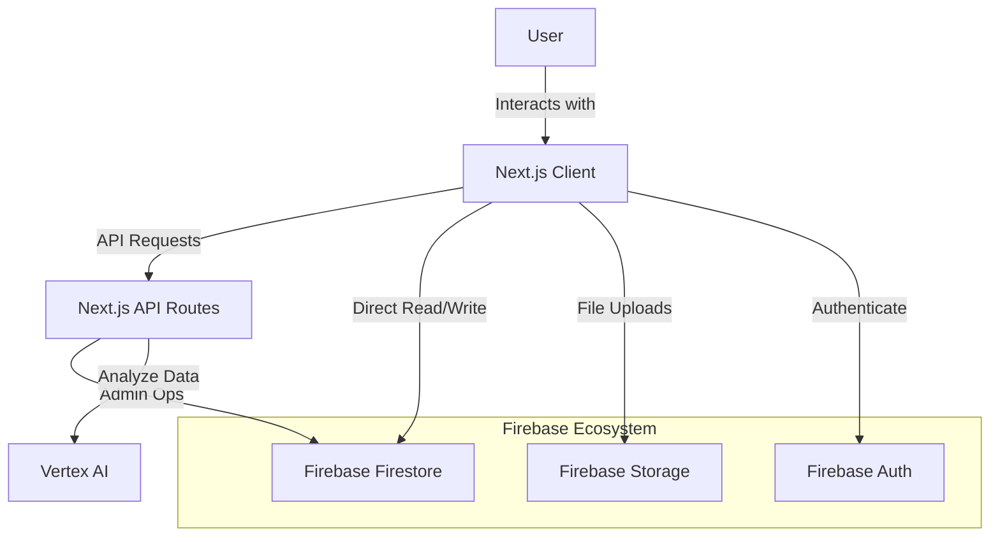

# System Architecture

## Overview
Equiptalk AI is a modern web application designed for efficient equipment management. It leverages a serverless architecture using Next.js for the frontend and API layer, and Firebase for backend services including database, authentication, and file storage.

## Technology Stack

### Frontend
- **Next.js 15+ (App Router):** The core framework for the application, handling routing, server-side rendering (SSR), and static site generation (SSG).
- **TypeScript:** Ensures type safety and improves code maintainability.
- **Tailwind CSS:** A utility-first CSS framework for rapid and responsive UI development.
- **Dnd Kit:** Provides drag-and-drop capabilities for equipment hierarchy management.
- **Recharts:** Used for data visualization in the dashboard.

### Backend & Services
- **Firebase Firestore:** A NoSQL cloud database for storing structured data (equipment, incidents, users).
- **Firebase Authentication:** Handles user sign-up, login, and session management.
- **Firebase Storage:** Stores user-uploaded files, such as equipment images and documents.
- **Google Cloud Vertex AI:** Integrates AI capabilities for advanced features (e.g., predictive maintenance analysis, automated tagging).

## Data Flow

The following diagram illustrates the high-level data flow within the application:

## Key Components

### Dashboard
The central hub for users to view equipment status, recent incidents, and performance metrics. It aggregates data from various Firestore collections.

### Equipment Management
Allows users to create, read, update, and delete equipment records. It supports hierarchical relationships (parent-child equipment) and media attachments.

### Incident Reporting
Enables users to report issues with equipment. It includes strict verification steps (e.g., typing "DELETE" to confirm critical actions) and integrates with the equipment database.

## Directory Structure
- `src/app`: Next.js App Router pages and API routes.
- `src/components`: Reusable UI components.
- `src/lib`: Utility functions and Firebase configuration.
- `public`: Static assets.
